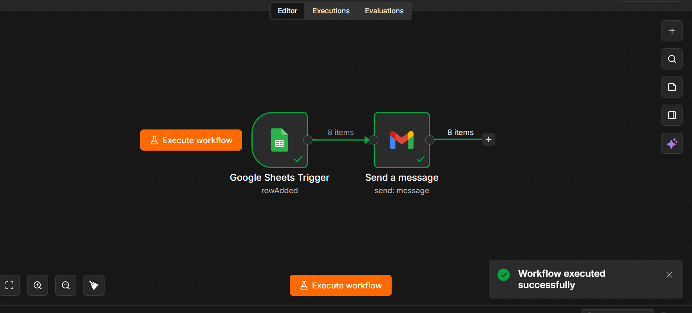
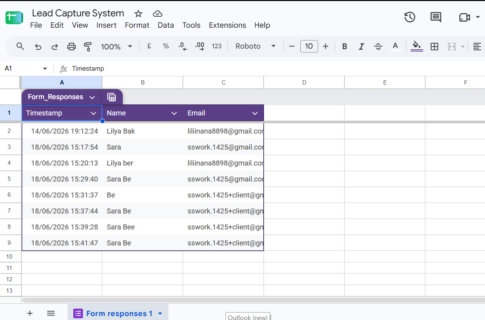
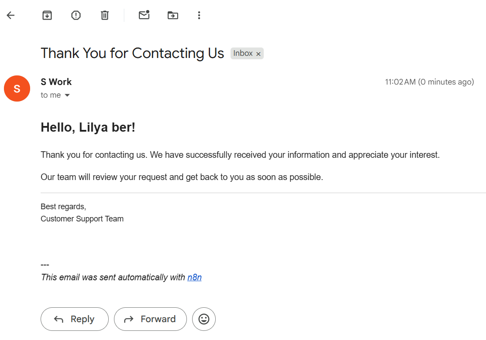

# 📥 Lead Capture & Automated Response System

An automated lead processing system built with **n8n**, **Google Sheets API**, and **Gmail API**. It captures incoming sales leads from webforms in real time, records entry metadata into a Google Sheets database, and sends tailored confirmation emails to potential clients.

---

## 📽️ System Live Demo
📺 **[Click Here to Watch the 1-Minute Live Demo Video](https://www.loom.com/share/d26054758f2d400fb74527aa4cf525b3)**

---

## 📸 System Screenshots & Visual Proof

| n8n Workflow Canvas | Google Sheets Database | Gmail Confirmation Email |
| :---: | :---: | :---: |
|  |  |  |

---

## 🔑 Key Features
* **Real-Time Webform Trigger**: Captures submissions instantaneously without manual intervention.
* **Structured Data Logging**: Appends incoming lead data directly to a Google Sheets document.
* **Automated Email Outreach**: Delivers personalized confirmation emails via Gmail OAuth 2.0 integration.

---

## 🛠️ Tech Stack
* **Workflow Engine**: n8n
* **Database / CRM**: Google Sheets API
* **Email Engine**: Gmail API (OAuth 2.0)

---

## 🎯 Business Impact & Value
* **Zero Lead Drop-off**: Ensures 100% of incoming inquiries are logged instantly without human error.
* **Instant Client Engagement**: Sends immediate automated response emails, keeping potential buyers warm and engaged.
* **Streamlined Operations**: Saves administrative hours weekly by automating manual data entry into Google Sheets.
